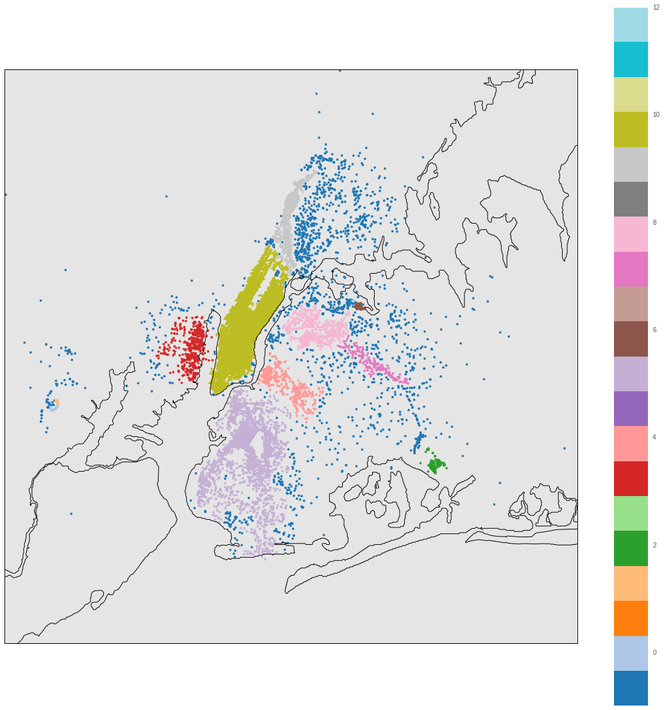

# Kaggle NYC Taxi Fare Prediction Kaggle Solution (Top 2% Ranked 21st/1400)

This repository is the solution that obtains the top 2% ranking of NYC Taxi Fare Prediction competition in Kaggle.

## Data cleaning ( refer to `data_cleaning.py`)
* remove null records
* remove records whose locations are not within range provided in test data
* remove data points in sea
* eliminate outlier according to fare distribution

## Data preprocessing ( refer to `Data_preprocessing.py`)
* the new feature `cluster` is added. 
	* during data exploration, I found that the fare/distance ratio is varying according to the location. So, I add the new categorical feature to specify the area of the dropoff location and pickup location
	* I used **HDBScan** to get the clustering model. Then, I use this model to predict the area of each record.
		
* the new feature `distance` is added
* the new feature `distance to airport` is added
* categorical data are **changed to float32** to prevent memory surge due to Lightgbm python package.  (The library will convert all data to float. So if the data is integer, new data will be created)

## train and predict ( refer to `train_predict.py`)
* **lightgbm** is used, and it was trained in the Amazon EC2 instance
* With this model, the test score is 2.85311
